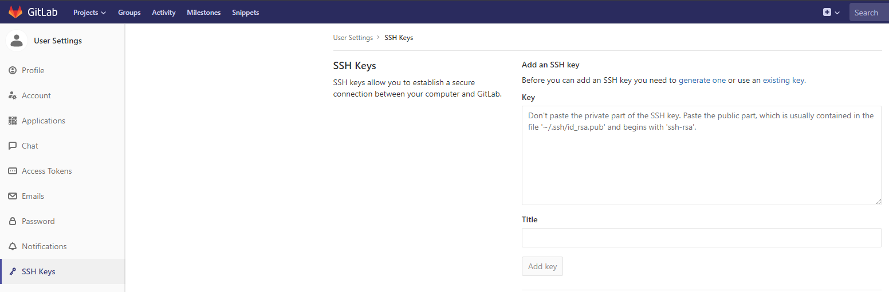
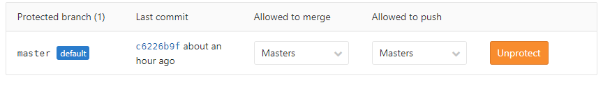
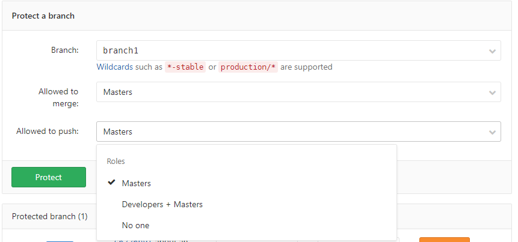
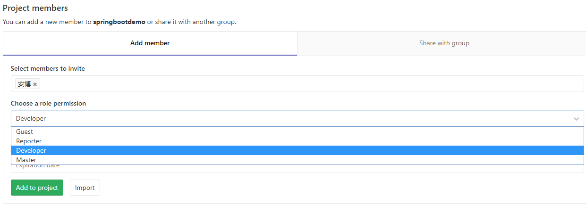

# GitLab基本用法
本文档基于Windows操作系统

> 目录

* [gitLab基本用法](#gitlab基本用法)
    * [设置ssh_key](#设置ssh_key)
    * [建立工程](#建立工程)
    * [配置工程分支权限](#配置工程分支权限)
    * [配置工程人员权限](#配置工程人员权限)
    * [新建分支与合并分支（基于Idea)](#新建分支与合并分支)   
    
    
# gitlab基本用法

## 设置ssh_key

> 主要步骤

* 注册Gitlab账号
* 为gitlab生成key
  * 打开Git Bash
  * ssh-keygen -t rsa -C "your.email@example.com" -b 4096
  * 提示输入保存路径，可修改，直接回车则使用默认路径
  * 提示输入密码与重复输入密码，回车跳过则不使用密码
* 将key保存到Gitlab
  * 登录账号，打开Settings->SSH Keys
  * 打开创建SSH Key时的路径，默认为C:\Users\Username\.ssh\id_rsa.pub
  * 用文本编辑器打开并复制全部内容到网页上并输入title

  * 点击“AddKey”保存即可

## 建立工程
* Project主页点击NewProject
* 填写Project名字，选择可见性
  * Private---仅自己可见
  * Internal--登陆用户可见
  * Public----所有人可见

## 配置工程分支权限
* 选择Project->Settings->Repository->Protected Branches
   * Master分支默认为Protected，仅可由有Master权限的用户进行修改（关于用户权限将在下一小节介绍）
   * 可以对Merge与Push权限进行设置，或点击Unprotect解除保护

   * 可以对任一分支建立保护规则，对不同权限用户进行不同的操作保护
      

## 配置工程人员权限
* 选择Project->Settings->Repository->Members
   * 在Add Member中添加用户，以将用户添加到当前工程中
   * 根据需求选择用户权限，不同权限对项目有不同的访问权限
   * 选择该规则的到期时间，非必填

* 不同的用户对项目有不同的访问权限，对于Public或Internal项目，普通用户默认为Guest权限。
* 用户权限对应下表所示（节选）

|操作|Guest|Reporter|Developer|Master|Owner|
|----|-----|----|-----|----|-----|
|提交新的问题|✓|✓|✓|✓|✓|
|提交私密的问题|✓|✓|✓|✓|✓|
|查看私密问题|仅可查看自己提交的|✓|✓|✓|✓|
|进行评论|✓|✓|✓|✓|✓|
|查看问题的讨论||✓|✓|✓|✓|
|锁定关于合并请求的讨论|||✓|✓|✓|
|拉取项目代码|✓|✓|✓|✓|✓|
|下载项目|✓|✓|✓|✓|✓|
|创建合并请求|||✓|✓|✓|
|管理/同意合并请求|||✓|✓|✓|
|向非保护分支提交代码|||✓|✓|✓|
|向保护分支提交代码||||✓|✓|
|修改分支保护状态||||✓|✓|
|修改项目可见状态|||||✓|
|删除问题|||||✓|

## 新建分支与合并分支
* 新建分支
   * VCS->Git->Branches(或在项目上右键Git->Repository->Branches)
   * 选择＋New Branch，输入分支名即可
* 分支切换
   * 分支切换之前一定要保存到本地仓库
     * Git->Add
     * Git->Commit Directory
     * 视个人需要决定是否push到当前分支
   * Idea右下角选择Git:当前分支，在弹出列表中选择要切换的分支->Check out
* 分支提交与合并
   * 提交：Git->Push,选择目标Branch即可
   * 合并：在网页端对Branch发起Merge Request，填写相关信息后由管理者审核
      *Idea里面的Merge Changes没用明白，Merge成功之后没有收到Merge Request，希望比较了解的大佬指导一下 
      
##参考资料

[在Idea中实战Git](https://www.2cto.com/kf/201609/547838.html)